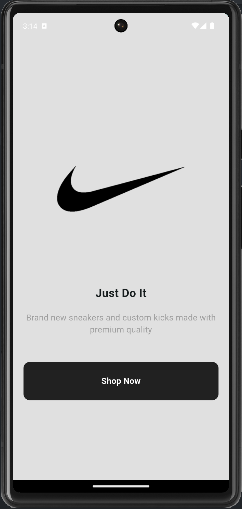
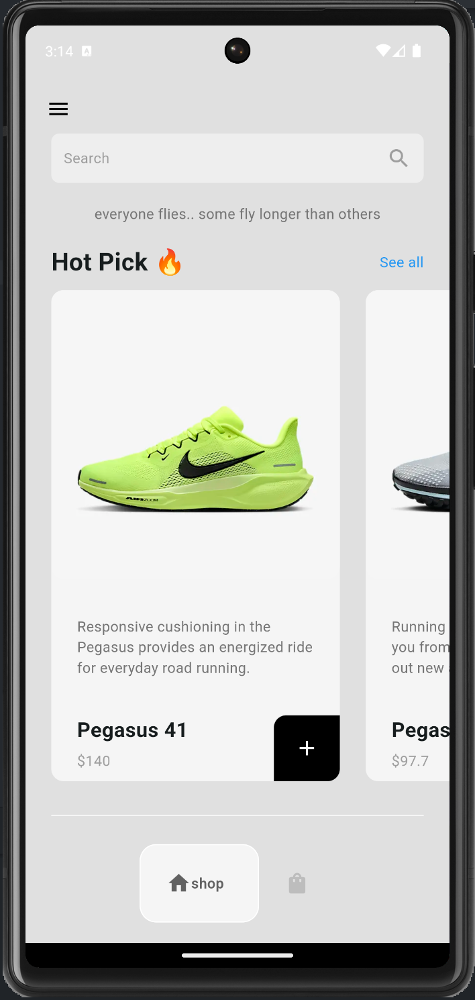
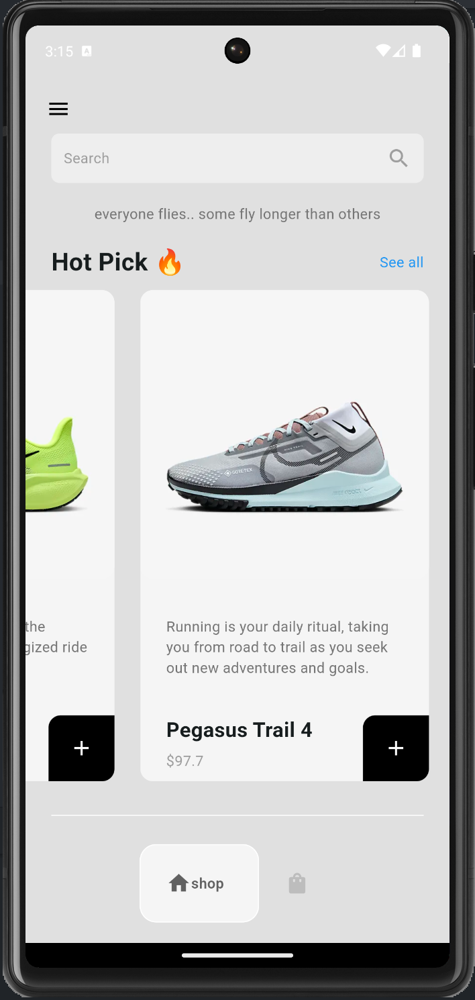
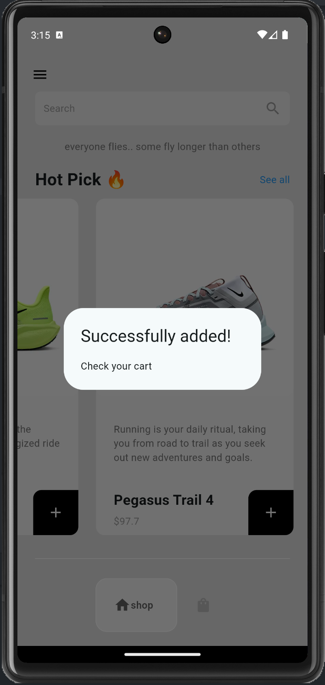
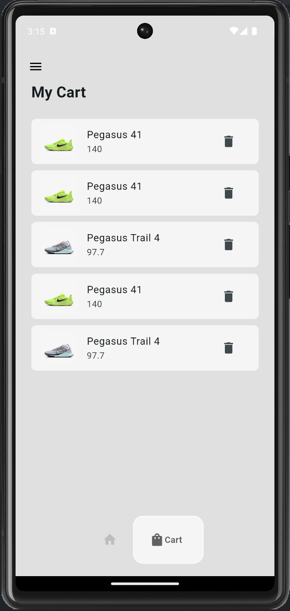

## Flutter Sneaker Shop Application UI Design

A part of #flutter100daysofcode. Let's create a beautiful and animated Shoes Shop Application UI with Flutter.

## Development Setup

Clone the repository and run the following commands:

```
flutter pub get
flutter run
```

## ScreenShot

&nbsp;&nbsp;&nbsp;&nbsp;
